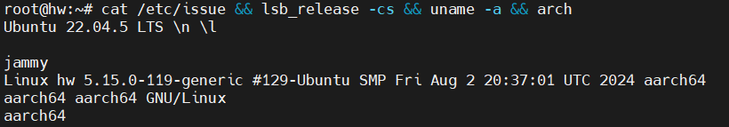
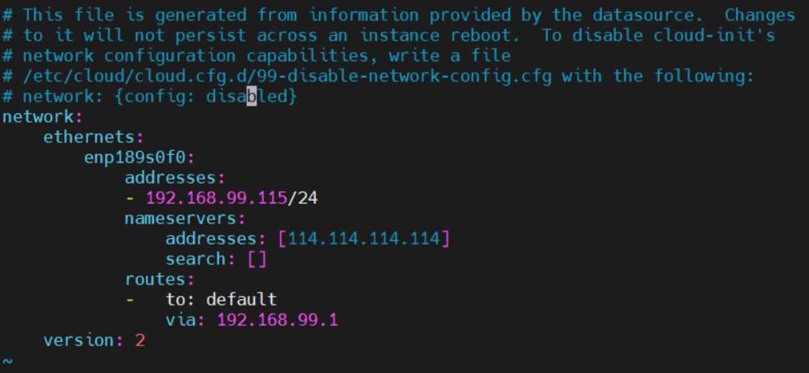
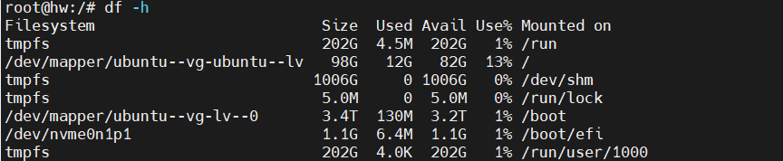

## 安装引导

检查操作系统版本、版本代号、内核版本、架构

```bash
cat /etc/issue && lsb_release -cs && uname -a && arch
```



## 初始化配置

### 用户初步管理

#### 启用root

Ubuntu安装时，强制让用户创建了一个普通用户，但却没有让配置root用户。

Ubuntu默认不建议用户直接使用root，这里可以通过设置root口令让root可用。

```bash
sudo passwd root
su - root
```

这时root可以在控制台登录，或 `su`到root，但不能使用root通过sshd直接登录。

### 配置sshd

`vim /etc/ssh/sshd_config`

找到：
`#PermitRootLogin prohibit-password`

改为：
`PermitRootLogin yes`

重启sshd服务：
`systemctl restart sshd`

#### 创建其他用户

可以酌情，通过 `groupadd`、`useradd`、`passwd`创建其他用户。

==后续都使用root用户完成初始化配置。==

### 网络配置

#### 修改主机名

安装Ubuntu时已经指定了主机名，可以用以下命令随时修改并永久生效

```bash
sudo hostnamectl --static set-hostname NEW_HOSTNAME
```

值得注意的是，除了使用 `hostnamectl`修改，Ubuntu的hosts表中还用127.0.1.1绑了初始的主机名，这里一并修改

```bash
vim /etc/hosts
将
127.0.1.1 ORI_HOSTNAME
改为
127.0.1.1 MY_NEW_HOSTNAME
注意不要修改127.0.0.1那一行。
```

#### 配置静态 IP 地址

作为服务器使用的 Linux server，一定要绑死固定 IP 地址，而非使用 DHCP。

> Ubuntu-22版本，对网络配置文件做了大幅度更改，配置使用 yaml 格式，且换成 netplan 管理网络

默认情况下，安装完的Ubuntu，使用 DHCP 获取网络

```bash
cat /etc/netplan/00-installer-config.yaml
```

```yaml
# This is the network config written by 'subiquity'
network:
  ethernets:
    ens33:
      dhcp4: true
  version: 2
```

修改为：

```yaml
network:
  renderer: networkd
  ethernets:
    ens33:
      addresses:
        - 192.168.172.141/24
      nameservers:
        addresses: [223.5.5.5, 8.8.8.8]
      routes:
        - to: default
          via: 192.168.172.2
  version: 2
```

配置含义：

- 节点IP为192.168.172.141，子网掩码为255.255.255.0即24，默认网关为192.168.172.2。
- 主DNS为阿里云的223.5.5.5，备DNS为8.8.8.8。

```bash
# 实例
vi /etc/netplan/50-cloud-init.yaml
```



> 在DNS(nameservers-addresses)列表中添加了114.114.114.114。
> 配置含义：节点IP：192.168.99.115，掩码：24，网关：192.168.99.1，DNS：114.114.114.114。

使网络修改生效：

```bash
sudo netplan apply
```

#### 验证互联网可达

```bash
ping www.baidu.com
curl https://www.baidu.com
```

> curl命令如果暂时没有，则等待apt源配置完成后，再来验证。也可以使用 `apt install curl`先行安装。

### 时钟配置

#### 设置时区

默认安装完的Ubuntu，使用的是通用时区UTC，和北京时间差8小时，除非是有全球化应用的需要，否则该默认配置一定要改。

这里需要改为本地时区CST模式，并设置为东八区时间（Asia/Shanghai, CST, +0800）

```bash
timedatectl set-timezone Asia/Shanghai
```

修改后，可以通过下面的命令查看当前时区和时间格式：

```bash
timedatectl status
               Local time: Sun 2023-12-17 11:25:08 CST
           Universal time: Sun 2023-12-17 03:25:08 UTC
                 RTC time: Sun 2023-12-17 03:25:08
                Time zone: Asia/Shanghai (CST, +0800)
System clock synchronized: yes
              NTP service: active
          RTC in local TZ: no
```

#### 设为24小时格式（可选）

ubuntu默认使用12小时格式，这里可以按照习惯，选择改为24小时模式。

```bash
echo "LC_TIME=en_DK.UTF-8" >> /etc/default/locale
```

注意这个修改，无法通过sudo实现，必须使用root用户进行修改。

修改后，通过date命令查看

```bash
date
Sun Dec 17 11:31:45 CST 2023
```

#### 设置时钟同步（可选？）

对于任意的集群环境，节点间的时间必须精确一致，因此时钟同步必须设置。

```bash
vim /etc/systemd/timesyncd.conf
```

这里使用腾讯的时钟同步服务器。

改前：

```bash
#NTP=
#FallbackNTP=ntp.ubuntu.com
#RootDistanceMaxSec=5
#PollIntervalMinSec=32
#PollIntervalMaxSec=2048
```

改后：

```
NTP=ntp.tencent.com
FallbackNTP=ntp1.tencent.com,ntp2.tencent.com,ntp3.tencent.com
RootDistanceMaxSec=5
PollIntervalMinSec=32
PollIntervalMaxSec=2048
```

保存退出，重启时钟同步服务

```bash
systemctl restart systemd-timesyncd
systemctl status systemd-timesyncd
```

当systemd-timesyncd的状态里，显示了时钟同步的服务器，则表明时钟同步服务器调用成功

```bash
Status: "Initial synchronization to time server 106.55.184.199:123 (ntp.tencent.com)."
```

用 `timedatectl`可以查看时钟同步状态

```bash
$ timedatectl
......
System clock synchronized: yes
              NTP service: active
......
```

这里的yes，表示时钟同步已经成功。

### Ubuntu安装Docker

```bash
# 旧版本卸载
apt-get remove docker docker-engine docker.io containerd runc
# 安装依赖包
apt-get update
apt-get install ca-certificates curl gnupg lsb-release
# 添加官方密钥
curl -fsSL http://mirrors.aliyun.com/docker-ce/linux/ubuntu/gpg | sudo apt-key add -
# 设置稳定版仓库
sudo add-apt-repository \
	"deb [arch=amd64] https://mirrors.ustc.edu.cn/docker-ce/linux/ubuntu/ \
	$(lsb_release -cs) \
	stable"
# 安装最新版本的 Docker Engine-Community 和 containerd
apt-get install docker-ce docker-ce-cli containerd.io
docker -v
```

## 安装后产生的问题

### 磁盘分配错了



1. 应该把ubuntu--vg-lv--0挂到/下
2. 那原来的/boot怎么弄

#### 解决方案

==TODO==

看硬盘可用空间或者将其他的空间划分出来分配到指定路径

fdisk工具

parted工具

```bash
$ lsblk
NAME                      MAJ:MIN RM  SIZE RO TYPE MOUNTPOINTS
loop0                       7:0    0 59.8M  1 loop /snap/core20/2321
loop1                       7:1    0 77.4M  1 loop /snap/lxd/29353
loop2                       7:2    0 33.7M  1 loop /snap/snapd/21761
nvme1n1                   259:0    0  3.5T  0 disk 
└─nvme1n1p1               259:2    0  3.5T  0 part 
nvme0n1                   259:1    0  3.5T  0 disk 
├─nvme0n1p1               259:3    0    1G  0 part /boot/efi
├─nvme0n1p2               259:4    0    2G  0 part 
└─nvme0n1p3               259:5    0  3.5T  0 part 
  ├─ubuntu--vg-ubuntu--lv 253:0    0  100G  0 lvm  /
  └─ubuntu--vg-lv--0      253:1    0  3.4T  0 lvm  /boot
```

缩小 `/boot` 大小，调整 `/` 大小：

1. 查看/boot分区是否被挂载(可选) `mount | grep /boot`
2. 卸载分区：`umount /boot`
3. 缩小逻辑卷为 500M：`lvreduce -L -500M ubuntu--vg-lv--0`
4. 调整/分区的逻辑卷大小到可用空间的最大值：`lvextend -l +100%FREE /dev/ubuntu--vg-ubuntu--lv`
5. 调整文件系统的大小：`resize2fs /dev/ubuntu--vg-ubuntu--lv`
6. 重新挂载/boot分区：`mount /dev/ubuntu--vg-lv--0 /boot`
7. 验证分配后的根目录大小：`df -h`

# 附录

## lsblk表头解释

- `NAME`: 设备的名称。
- `MAJ:MIN`: 主设备号和次设备号。
- `RM`: 设备是否可移动（1表示是，0表示否）。
- `SIZE`: 设备的大小。
- `RO`: 设备是否为只读模式（1表示是，0表示否）。
- `TYPE`: 设备的类型（例如disk, part, loop等）。
- `MOUNTPOINTS`: 设备挂载的路径。

## 设备类型

1. **disk**: 表示这是一个物理存储设备，比如硬盘驱动器、固态硬盘（SSD）或USB闪存驱动器。它通常包含一个或多个分区。
   1. **part**: 表示这是一个分区，它是物理存储设备（disk）上的一个逻辑部分。分区是用于组织和管理磁盘空间的区域。
2. loop: 表示这是一个回环设备，它允许文件系统被当作块设备挂载。通常用于挂载磁盘映像文件（如ISO文件）。
3. rom: 表示只读存储器，通常用于存储固件或系统引导信息。
4. **lvm**: 表示逻辑卷管理（Logical Volume Management）设备。LVM是一种高级存储管理技术，它允许将多个物理存储设备组合成一个逻辑存储池，并在其中创建和管理逻辑卷。
5. dm: 表示设备映射，通常用于Linux内核的设备映射器，它可以用于创建设备映射，如软件RAID、LVM或加密设备。
6. crypt: 表示加密设备，通常用于LUKS（Linux Unified Key Setup）加密的存储设备。
7. raid: 表示RAID（冗余阵列）设备，用于将多个物理存储设备组合成一个逻辑设备以提供冗余、性能提升或两者兼具。
8. scsi: 表示小型计算机系统接口（SCSI）设备，这是一种用于连接和识别存储设备的接口。
9. nvme: 表示非易失性内存快速存储技术（NVMe）设备，这是一种高性能的存储接口，通常用于固态硬盘。
10. sata: 表示串行高级技术附件（SATA）设备，这是一种常见的硬盘和固态硬盘接口。

## `/etc`目录

etc不是缩写，而是and so on。etc目录在Linux系统中用于存放各种配置文件，包括网络配置文件。

## DNS服务器选择

| DNS提供商         | DNS服务器IP地址      |
| ----------------- | -------------------- |
| 百度公共DNS服务IP | 180.76.76.76         |
| 阿里云DNS         | 223.6.6.6, 223.5.5.5 |
| 腾讯DNS           | 119.29.29.29         |
| 电信              | 101.226.4.6          |
| 联通              | 123.125.81.6         |
| 移动              | 101.226.4.6          |
| 铁通              | 101.226.4.6          |

| 服务描述             | DNS服务器IP地址                  |
| -------------------- | -------------------------------- |
| 纯净无劫持           | 114.114.114.114, 114.114.114.115 |
| 拦截钓鱼病毒木马网站 | 114.114.114.119, 114.114.115.119 |
|                      | 114.114.114.110, 114.114.115.110 |
